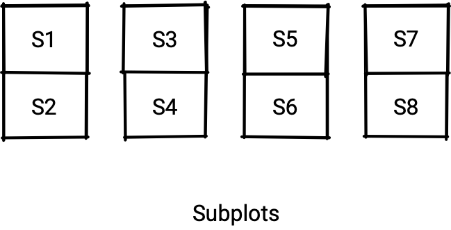
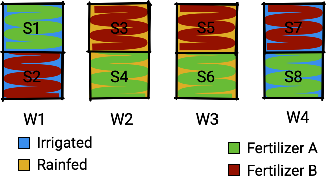

```{r, include = FALSE}
knitr::opts_chunk$set(
  fig.path = "images/",
  fig.width = 6,
  fig.height = 4,
  fig.align = "center",
  fig.retina = 2,
  echo = TRUE,
  warning = FALSE,
  message = FALSE,
  cache = FALSE,
  cache.path = "cache/"
)
pdflink <- rmarkdown::metadata$pdflink
knitr::read_chunk("art.R")
```

class: middle center hide-slide-number monash-bg-gray80


```{r, include = FALSE, cache = FALSE}
library(tidyverse)
basename <- ifelse(exists("basename"), basename, "slide")

```


.info-box.w-50.bg-white.f3[
These slides are viewed best by Chrome or Firefox and occasionally need to be refreshed if elements did not load properly. See <a href=`r pdflink`>here for the PDF <i class="fas fa-file-pdf"></i></a>.
]

<br>

.white[Press the **right arrow** to progress to the next slide!]


---

count: false
class: fullscreen title-slide
background-image: url("images/art-01.png")
background-size: cover

<br>

.pl3[
# .gray[`r rmarkdown::metadata$title`]

.animate-text[
.monash-green2[.s[S].s[o].s[f].s[t].s[w].s[a].s[r].s[e]] & <br>&emsp; .monash-ruby2[.s[E].s[x].s[p].s[e].s[r].s[i].s[m].s[e].s[n].s[t].s[a].s[l]] Design
]

]

.bottom_abs.w-100.bg-shadow.h-45.slideInUp.animated.pl3.delay-1s[

Presenter: *`r rmarkdown::metadata$author`*

.f3[
`r rmarkdown::metadata$department`  
  
<i class="fas fa-envelope"></i>  `r rmarkdown::metadata$email` &nbsp;&nbsp;<i class="fab fa-twitter"></i> @statsgen

<i class="fas fa-calendar-alt"></i> `r rmarkdown::metadata$date` | `r rmarkdown::metadata$host`

<br>

]

]

.r-button[
<i class="fab fa-r-project animated rotate"></i>
]
.r-code[
```{r art01, eval = FALSE}
```

]

---

class: fullscreen

.flex.h-100.bg-rladies-dark[
.w-75.white.pa3.f1[


.header.f1[<i class="fas fa-theater-masks"></i> Now Showing]

.f2.pa3.lh-copy[

.box[Act I] **Software design**  
.f3[<i class="fas fa-smile-beam"></i> Drawing faces under different .yellow[programming paradigms]]   
.box[Act II] **Experimental design**  
.f3[<i class="fas fa-grimace"></i> Comparative experiments with `edibble`]


.border-box.bg-rladies.white.f3[
.center[
<i class="fas fa-link"></i> These slides made using R powered by HTML/CSS/JS can be found at<br><a style="color:yellow!important" href="https://emitanaka.org/slides-RLadiesMelb2021">emitanaka.org/slides-RLadiesMelb2021</a><br>
<i class="fab fa-github"></i> All code to reproduce this slide can be found at <a style="color:yellow!important" href="https://github.com/emitanaka/slides-RLadiesMelb2021">github.com/emitanaka/slides-RLadiesMelb2021</a>

]]

]]
.w-25[
<Br>

]]

.r-button[
<i class="fab fa-r-project white"></i>
]
.r-code[
```{r art02, eval = FALSE}
```

]


</div>


---

class: transition

.center[
.clapper[
.clapper-top[
]
.clapper-bottom[
]]]

# .gray[Act I]

# Software Design

---


class: transition bg-rladies

## <i class="fas fa-surprise"></i> <i class="fas fa-smile-wink"></i> <i class="fas fa-smile-beam"></i> <i class="fas fa-sad-tear"></i> <i class="fas fa-sad-cry"></i> <i class="fas fa-meh-rolling-eyes"></i> <i class="fas fa-meh-blank"></i> <i class="fas fa-meh"></i> <i class="fas fa-grin-wink"></i> <i class="fas fa-grin-stars"></i> <i class="fas fa-grin-squint-tears"></i> <i class="fas fa-grin-squint"></i> <i class="fas fa-grin-hearts"></i> <i class="fas fa-grin-beam"></i> <i class="fas fa-grin-alt"></i> <i class="fas fa-grin"></i> <i class="fas fa-tired"></i> <i class="fas fa-smile"></i>

<br>

# Drawing faces under different .yellow[programming paradigms]

<br>

##  <i class="fas fa-laugh-wink"></i> <i class="fas fa-laugh-squint"></i> <i class="fas fa-laugh-beam"></i> <i class="fas fa-laugh"></i> <i class="fas fa-kiss-wink-heart"></i> <i class="fas fa-kiss-beam"></i> <i class="fas fa-kiss"></i> <i class="fas fa-grin-tongue-wink"></i> <i class="fas fa-grin-tongue-squint"></i> <i class="fas fa-grin-tongue"></i> <i class="fas fa-grin-tears"></i> <i class="fas fa-grin-beam-sweat"></i> <i class="fas fa-grimace"></i> <i class="fas fa-frown-open"></i> <i class="fas fa-frown"></i> <i class="fas fa-flushed"></i> <i class="fas fa-angry"></i> <i class="fas fa-dizzy"></i>

---


# Drawing a .yellow[happy] face .circle[1]

???

* To illustrate the different programming paradigms, I'm going to show different ways to design the software to draw faces

---

count: false

# Drawing a .yellow[happy] face .circle[1]

.flex[
.w-50[
.f4[
```{r happy-1, eval = FALSE}
library(grid)
# face shape
grid.circle(x = 0.5, y = 0.5, r = 0.5)
```
]
]
.w-50[
.f4[

<br>

```{r happy-1, echo = FALSE}
```
]

]

]

---

count: false

# Drawing a .yellow[happy] face .circle[1]

.flex[
.w-50[
.f4[
```{r happy-2, eval = FALSE}
library(grid)
# face shape
grid.circle(x = 0.5, y = 0.5, r = 0.5)

# eyes
grid.circle(x = c(0.35, 0.65),
            y = c(0.6, 0.6),
            r = 0.05,
            gp = gpar(fill = "black"))
```
]
]
.w-50[
.f4[

<br>

```{r happy-2, echo = FALSE}
```
]

]

]

---

count: false


# Drawing a .yellow[happy] face .circle[1]

.flex[
.w-50[
.f4[
```{r happy-3, eval = FALSE}
library(grid)
# face shape
grid.circle(x = 0.5, y = 0.5, r = 0.5)

# eyes
grid.circle(x = c(0.35, 0.65),
            y = c(0.6, 0.6),
            r = 0.05,
            gp = gpar(fill = "black"))

# mouth
grid.curve(x1 = 0.4, y1 = 0.4,
           x2 = 0.6, y2 = 0.4,
           square = FALSE)
```
]
]
.w-50[
.f4[

<br>

```{r happy-3, echo = FALSE}
```
]

]

]

---

# Drawing a .rladies-gray[sad] face .circle[1]

???

* Switch to drawing a sad face

---

count: false

# Drawing a .rladies-gray[sad] face .circle[1]

.flex[
.w-50[
.f4[
```{r sad-1, eval = FALSE}
library(grid)
# face shape
grid.circle(x = 0.5, y = 0.5, r = 0.5)

# eyes
grid.circle(x = c(0.35, 0.65),
            y = c(0.6, 0.6),
            r = 0.05,
            gp = gpar(fill = "black"))

# mouth
grid.curve(x1 = 0.4, y1 = 0.4,
           x2 = 0.6, y2 = 0.4,
           square = FALSE,
           curvature = -1) #<<
```
]
]
.w-50[
.f4[

<br>
.animated.delay-1s.zoomIn[
```{r sad-1, echo = FALSE}
```
]
]
]

]


---

name: imperative

# Drawing faces .circle[1] .yellow[*Imperative programming*] style

.flex[
.w-50.pr3[
.f4[
```{r happy, eval = FALSE}
library(grid)
grid.circle(x = 0.5, y = 0.5, r = 0.5)
grid.circle(x = c(0.35, 0.65),
            y = c(0.6, 0.6),
            r = 0.05,
            gp = gpar(fill = "black"))
grid.curve(x1 = 0.4, y1 = 0.4,
           x2 = 0.6, y2 = 0.4,
           square = FALSE)
```
.animated.flash[
```{r happy, fig.height = 2.1, fig.width = 2.1, echo = FALSE}
```
]]
]
.w-50[
.f4[
```{r sad, eval = FALSE}
grid.circle(x = 0.5, y = 0.5, r = 0.5)
grid.circle(x = c(0.35, 0.66),
            y = c(0.6, 0.6),
            r = 0.05,
            gp = gpar(fill = "black"))
grid.curve(x1 = 0.4, y1 = 0.4,
           x2 = 0.6, y2 = 0.4,
           square = FALSE,
           curvature = -1)
```
.animated.flash[
```{r sad, fig.height = 2.1, fig.width = 2.1, echo = FALSE}
```
]]

]

]

--

.absolute.left-3.bottom-0[
.info-box.w-70[
**Imperative programming** is a programming paradigm that uses statements to change a program's state.
.fr[&mdash;Wikipedia]

<br> Think of this as _**"instructions meant for the computer"**_

]]

---


# Drawing faces .circle[2] .yellow[*Functional programming*] style

.flex[
.w-60.h-100.pr3[
```{r face-fns}
face1 <- function() {
  grid::grid.circle(x = 0.5, y = 0.5, r = 0.5)
  grid::grid.circle(x = c(0.35, 0.65),
                    y = c(0.6, 0.6),
                    r = 0.05,
                    gp = gpar(fill = "black"))
  grid::grid.curve(x1 = 0.4, y1 = 0.4,
                   x2 = 0.6, y2 = 0.4,
                   square = FALSE)
}

face2 <- function() {
  grid::grid.circle(x = 0.5, y = 0.5, r = 0.5)
  grid::grid.circle(x = c(0.35, 0.65),
                    y = c(0.6, 0.6),
                    r = 0.05,
                    gp = gpar(fill = "black"))
  grid::grid.curve(x1 = 0.4, y1 = 0.4,
                   x2 = 0.6, y2 = 0.4,
                   square = FALSE,
                   curvature = -1)
}
```

]
.w-40[
.info-box[
**Functional programming** is a declarative programming paradigm where programs are constructed by applying and composing functions.
.fr[&mdash;Wikipedia]
]


]
]


???

* Wrap the previous imperative commands as a function


---

count: false

# Drawing faces .circle[2] .yellow[*Functional programming*] style

.flex[
.w-60.h-100.pr3[
```{r face-fns}
```

]
.w-40[
.info-box[
**Functional programming** is a declarative programming paradigm where programs are constructed by applying and composing functions.
.fr[&mdash;Wikipedia]
]
.flex[
.w-50.pr2[
```{r happy-fn, fig.height = 0.95, fig.width = 0.95}
face1()
```

]
.w-50[

]

]
]
]

---

count: false

# Drawing faces .circle[2] .yellow[*Functional programming*] style

.flex[
.w-60.h-100.pr3[
```{r face-fns}
```

]
.w-40[
.info-box[
**Functional programming** is a declarative programming paradigm where programs are constructed by applying and composing functions.
.fr[&mdash;Wikipedia]
]
.flex[
.w-50.pr2[
```{r happy-fn, fig.height = 0.95, fig.width = 0.95}
```

]
.w-50[
```{r sad-fn, fig.height = 0.95, fig.width = 0.95}
face2()
```

]
]
]
]

---

count: false

# Drawing faces .circle[2] .yellow[*Functional programming*] style

.flex[
.w-60.h-100.pr3[
```{r face-fns}
```

]
.w-40[
.info-box[
**Functional programming** is a declarative programming paradigm where programs are constructed by applying and composing functions.
.fr[&mdash;Wikipedia]
]
.flex[
.w-50.pr2[
```{r happy-fn, fig.height = 0.95, fig.width = 0.95}
```
<br>
```{r happy-fn, fig.height = 0.95, fig.width = 0.95}
```

]
.w-50[
```{r sad-fn, fig.height = 0.95, fig.width = 0.95}
```
]
]
]
]

???

* I can repeatedly call the function
* Drawing happy or sad faces are easier now


---

count: false
name: functional

# Drawing faces .circle[2] .yellow[*Functional programming*] style

.flex[
.w-60.h-100.pr3[
```{r face-fns}
```

]
.w-40[
.info-box[
**Functional programming** is a declarative programming paradigm where programs are constructed by applying and composing functions.
.fr[&mdash;Wikipedia]
]
.flex[
.w-50.pr2[
```{r happy-fn, fig.height = 0.95, fig.width = 0.95}
```
<br>
```{r happy-fn, fig.height = 0.95, fig.width = 0.95}
```

]
.w-50[
```{r sad-fn, fig.height = 0.95, fig.width = 0.95}
```
<br>
```{r happy-fn, fig.height = 0.95, fig.width = 0.95}
```
]

]


]
]


---


# Drawing faces .circle[3] Human-centered design

.f1[
<i class="fas fa-lightbulb"></i> Computational systems are adapted for human use
]

.flex[
.w-50[

.w-90[

.info-box.w-90[
**Syntactic sugar** means using function name or syntax in a programming language that is designed to make things **_easier to read or to express for humans_**.
]
]
]
.w-50[

]

]

---

count: false

# Drawing faces .circle[3] Human-centered design

.f1[
<i class="fas fa-lightbulb"></i> Computational systems are adapted for human use.
]

.flex[
.w-50[

.w-90[

.info-box.w-90[
**Syntactic sugar** means using function name or syntax in a programming language that is designed to make things **_easier to read or to express for humans_**.
]
]
]
.w-50[
.flex[
.w-33.pr2[
```{r happy-fn, fig.height = 2, fig.width = 2}
```
]
.w-33.pr2[
```{r sad-fn, fig.height = 2, fig.width = 2}
```
]
.w-33.pr2[
```r
face3()
```
.center.f-headline[
?

]
]
]
]

]


---

count: false


# Drawing faces .circle[3] Human-centered design

.f1[
<i class="fas fa-lightbulb"></i> Computational systems are adapted for human use
]

.flex[
.w-50[

.w-90[

.info-box.w-90[
**Syntactic sugar** means using function name or syntax in a programming language that is designed to make things **_easier to read or to express for humans_**.
]
]
]
.w-50[
.flex[
.w-33.pr2[
```{r happy-fn, fig.height = 2, fig.width = 2}
```
]
.w-33.pr2[
```{r sad-fn, fig.height = 2, fig.width = 2}
```
]
.w-33.pr2[
```r
face3()
```
.center.f-headline[
?
]
]
]

<br>


Alternative function names:

.flex[
.w-33.pr2[
```r
face_happy()
```
]
.w-33.pr2[
```r
face_sad()
```

]
.w-33.pr2[
```r
face_angry()
```

]
]
]

]

---


class: center middle

.f1[What if you want to draw a surprised face? 😮]

--

.f1[Or a face with eyebrows? 😲]

--

.f1[Or with googly eyes? 😳]

--

<br>

.f1[**_You can't_** without writing a whole new function that describes the entire face from scratch.]

---

class: bg-rladies animated slideInLeft middle white center

<i class="fab fa-github"></i> .rladies-gray[https://github.com/emitanaka/portrait]

<i class="fas fa-box-open"></i> `remotes::install_github("emitanaka/portrait")`
.f-headline[
`library(portrait)`
]


.f2[We'll use the above package to draw faces.]

Note: the above package was made for only demonstration purpose for this talk.


---


# Drawing faces .circle[4] Rethinking function arguments as facial parts
--

.flex[
.w-50[

* Let's **_reframe_** how we think
* A face is made up of:
  * eyes
  * mouth
  * shape


]
.w-50[
{{content}}

]

]


--


* We can consider a design like below instead:

```{r face-googly, fig.height = 3, fig.width = 3}
library(portrait)
face(eyes = "googly",
     mouth = "smile",
     shape = "round")
```
{{content}}

--

<br>


* But what about hair and nose?


---

count: false


# Drawing faces .circle[4] Rethinking function arguments as facial parts


.flex[
.w-50[

* Let's **_reframe_** how we think
* A face is made up of:
  * eyes
  * mouth
  * shape
  * **hair** <i class="fas fa-hand-point-left"></i>
  * **nose** <i class="fas fa-hand-point-left"></i>


]
.w-50[
* Adding more arguments:

```{r face-googly-2, fig.height = 3, fig.width = 3}
library(portrait)
face(eyes = "googly",
     mouth = "smile",
     shape = "round",
     hair = "mohawk", #<<
     nose = "simple") #<<
```
{{content}}


]

]


---

class: middle center


.f1[But what about if I want to add a beard 🧔‍♂️, <br> an accessory 🤠, <br>eye brows 🤨, ...?]

<br>

.f1[You are **_reliant on the developer(s)_** to add the argument and/or functionality for you.]

---

layout: true

# Drawing faces .circle[5] .yellow[*Object-oriented programming*] style

.info-box.w-70[
**Object-oriented programming** (OOP) is a programming paradigm based on objects that have certain attributes and behaviours
]

* Rethink everything as an **_object_**

---

---

.flex.h-100[
.w-30.pr3[
```{r face1-code}
library(portrait)
f <- face() #<<

str(f)
```

]
.w-30.pr3[
.output-box.w-100[
```{r face1, fig.height = 2, fig.width = 2}
print(f)
```
]]
.w-40[
.summary-box.w-100[
* Function creates an object that contains a "standard" smiley face
* Only draws the face upon print
]
]
]

---

.flex.h-100[
.w-30.pr3[
```{r face2-code}
library(portrait)
f <- face() +
  cat_shape() #<<

str(f)
```

]
.w-30.pr3[
.output-box.w-100[
```{r face2, fig.width = 2, fig.height = 2}
print(f)
```
]]
.w-40[
.summary-box.w-100[
* .black[`cat_shape`] function modifies the shape information within the object
]
]
]

---


.flex.h-100[
.w-30.pr3[
```{r face3-code}
library(portrait)
f <- face() +
  cat_shape() +
  cat_eyes() #<<

str(f)
```


]
.w-30.pr3[
.output-box.w-100[
```{r face3, fig.width = 2, fig.height = 2}
print(f)
```
]]
.w-40[
.summary-box.w-100[
* .black[`cat_eyes`] function modifies the eye information within the object
]
]
]

---


.flex.h-100[
.w-30.pr3[
```{r face4-code}
library(portrait)
f <- face() +
  cat_shape() +
  cat_eyes() +
  cat_nose() #<<

str(f)
```


]
.w-30.pr3[
.output-box.w-100[
```{r face4, fig.width = 2, fig.height = 2}
print(f)
```
]]
.w-40[
.summary-box.w-100[
* .black[`cat_nose`] function adds nose information
]
]]


---


.flex.h-100[
.w-30.pr3[
```{r face5-code}
library(portrait)
f <- face() +
  cat_shape() +
  cat_eyes() +
  cat_nose() +
  cat_whiskers() #<<

str(f)
```


]
.w-30.pr3[
.output-box.w-100[
```{r face5, fig.width = 2, fig.height = 2}
print(f)
```
]
]
.w-40[
.summary-box.w-100[
* .black[`cat_whiskers`] function adds whiskers information
]

]
]

---


.flex.h-100[
.w-30.pr3[
```{r face6-code}
library(portrait)
f <- face() +
  dog_shape() + #<<
  cat_eyes(fill = "red") + #<<
  cat_nose() +
  cat_whiskers()

str(f)
```


]
.w-30.pr3[
.output-box.w-100[
```{r face6, fig.width = 2, fig.height = 2}
print(f)
```
]
]
.w-40[
.summary-box.w-100[
* Mix-and-match functions to make other faces
* The functions are modular so can be replaced by user's own functions
]

]
]

---

layout: false
class: bg-rladies center middle rladies-gray


.f1[Recipe functions <i class="fas fa-long-arrow-alt-right"></i><br> One function to draw one complete face]

<br>
--

.f1[A function with multiple arguments <i class="fas fa-long-arrow-alt-right"></i> <br>One function to draw multiple complete faces]

<br>
<br>

--


.animated.slideInLeft[
# .f1[Finite number of functions to draw<br> _infinite_ possible _incomplete_ and complete faces]

]


---


class: transition

.center[
.clapper[
.clapper-top[
]
.clapper-bottom[
]]]

# .gray[Act II]

# Experimental Design


---


# .f1[<i class="fas fa-book"></i> Classical "named" experimental designs]


.square-box[A] Completely Randomised Design

.square-box[B] Randomised Complete Block Design

.square-box[C] Latin Square Design

.square-box[D] Balanced Incomplete Block Design

.square-box[E] Factorial Design

.square-box[F] Split-plot Design {{content}}

--

<span class="shake animated infinite slow" style="display:inline-block;position:relative;"><i class="fas fa-arrow-circle-left f1 bounceInRight animated rladies-purple-dark" style=" vertical-align: middle;"></i></span>


---

background-color: #e3e3e3


# Classical split-plot design

.context-box[
Study of **two irrigation methods** and **two fertilizer brands** on the yields of a crop.
]

<br>
<center>

</center>


???

To begin with let's have a look at this classical split-plot design.
The context of this experiment is that it's a study on the yields of a crop with two irrigation methods, either irrigated or rain-fed, and two fertilizer brands.

So in order to conduct this study, the experimental resources that is available to us is this land where there are four fields, which I'm going to referring to these as the wholeplot.

---

background-color: #e3e3e3
count: false

# Classical split-plot design

.context-box[
Study of **two irrigation methods** and **two fertilizer brands** on the yields of a crop.
]

<br>
<center>

</center>


???

Now for the irrigation method, we have a restriction such that only one irrigation method can be applied per wholeplot. So what you see here, where we got the irrigated wholeplots on the edges and the rainfed wholeplots in the middle, is just one possible randomisation of the irrigation method on the whole plots.

---

background-color: #e3e3e3
count: false

# Classical split-plot design

.context-box[
Study of **two irrigation methods** and **two fertilizer brands** on the yields of a crop.
]

<br>
<center>

</center>


???

Then what we do next is to split the wholeplot into two subplots, which means that we have 8 subplots in total.

---

count: false
background-color: #e3e3e3

# Classical split-plot design

.context-box[
Study of **two irrigation methods** and **two fertilizer brands** on the yields of a crop.
]

<br>
<center>

</center>


???

Now the fertilizer can be applied to each subplots independently. We don't want to confound the fertilizer brands to the wholeplot, so for each wholeplot, we randomly apply one fertilizer brand to one subplot and the the remaining subplot receives the other fertilizer brand. What you see here is one possible restricted randomisation of fertilizer onto subplot.

---

background-color: #e3e3e3
count: false

# Classical split-plot design

.context-box[
Study of **two irrigation methods** and **two fertilizer brands** on the yields of a crop.
]

<br>
<center>

</center>


???

Putting together the two randomisation results, here we have our classical split plot design.


---

class: transition bg-rladies

```{r doe-pkgs, include = FALSE}
doe_pkgs <- ctv:::.get_pkgs_from_ctv_or_repos("ExperimentalDesign", repos = "https://cran.rstudio.com/")[[1]]
```

.lh-solid[
# .f-subheadline[CRAN Task View of <Br>Design of Experiments<br>] .f1[& Analysis of Experimental Data]
]


contains

# `r emo::ji("package")` .yellow[`r length(doe_pkgs)` R-packages ]


.f5[based on the .yellow[`ctv`] package version `r packageVersion("ctv")`]

--


.f1[of which `agricolae` package is <br>one of the most popular]


---


# `agricolae::design.split()`

**Split-plot design** for $t = 2 \times 4$ treatments with $2$ replication for each treatment

<pre><code>
trt1 <- c("I", "R")
trt2 <- c("A", "B")
agricolae::.bg-yellow[design.split](trt1 = trt1, trt2 = trt2, r = 2, design = "crd")
</code></pre>

.overflow-scroll.h-60[
```{r, echo = FALSE}
trt1 <- c("I", "R")
trt2 <- c("A", "B")
des <- agricolae::design.split(trt1 = trt1, trt2 = trt2, r = 2, design = "crd")
des
```
]


```{r split-plot-graph, fig.height = 3.5, fig.width = 3, fig.show="hide", echo = FALSE}
levels(des$book$trt2) <- LETTERS[1:4]
des$book %>%
  mutate(block = substring(plots, 3, 3)) %>%
  ggplot(aes(x = "", y = splots)) +
  geom_tile(aes(fill = trt1), color = "black", size = 1.2) +
  geom_text(aes(color = trt2, label = trt2), show.legend = T, fontface = "bold") +
  scale_color_manual(values = c("black", "brown", "darkviolet", "darkblue")) +
  facet_grid( . ~ block) +
  coord_equal() +
  theme_void(base_size = 18) +
  theme(legend.direction = "vertical")
```

<div class="plot-box" style="position:absolute;top: 300px; right: 200px;">


</div>

---

class: middle


.f1[Common .rladies-purple-dark[**software design**] for computational systems for constructing experimental design:]

.f2[
{{content}}
]

--

* Functions construct the experimental design from **_zero to its entirety_**
  * In another words, you can't have an intermediate construct of an experimental design
{{content}}

--

* Experimental units, observational units, blocks and allocation of treatment to units are often **_implicitly_ defined**
{{content}}


--

* The intention of what responses to record are **_not explicitly_ specified**


---

class: transition


# Let's _reframe_ how we think

--

but first some terminology so we're on the same page


---

# A basic comparative experiment

.w-75[
* There are three components that are *necessary* to run a comparative experiment:
  * a set of $\color{gray}{n}$ **experimental units** $(\Omega)$
  * a set of $\color{gray}{t}$ **treatments** $(\mathcal{T})$
  * **allocation** of treatments to experimental units $(D: \Omega \rightarrow \mathcal{T})$ <br>or design matrix $(\mathbf{X}_{n\times t})$
* And decide on **observational units** $(\Omega_o)$ which may or may not be the same as $\Omega$
{{content}}
]

--

* For the analysis of experimental, you additionally require:
  * the **record of responses** $(\boldsymbol{Y})$ on observational units

---

name: terms

# Terminology .f3.gray[modified versions of Bailey (2008)]

.flex[
.w-60.pr3[
.info-box.f3[
**Experimental unit** $(\Omega)$ is the smallest unit that the treatment can be independently applied to.
]
.info-box.f3[
**Observational unit** $(\Omega_o)$ is the smallest unit in which the response will be measured on. Not to be confused with observations  $\boldsymbol{Y}$.
]
.info-box.f3[
**Block**, also called **cluster**, is the unit that group some other units (e.g. experimental units) such that the units within the same block (cluster) are more alike (homogeneous).
]
]
.w-40[
.info-box.f3[
A **treatment** $(\mathcal{T})$ is the entire description of what can be applied to an experimental unit.
]

.info-box.f3[
A **design** $(D: \Omega \rightarrow \mathcal{T})$ is the allocation of treatments to units.
]

.info-box.f3[
A **plan** or **layout** is the design translated into actual units; randomisation is usually involved in the process.
]
]]


.absolute.top-0.right-1[
[<i class="fas fa-caret-right"></i>](#edibble)
]


.footnote[
Bailey, R. (2008). Design of Comparative Experiments (Cambridge Series in Statistical and Probabilistic Mathematics). Cambridge: Cambridge University Press. doi:10.1017/CBO9780511611483
]


---

# Experimental Structures .f3.gray[as defined by Bailey (2008)]

.flex[
.w-50[
.info-box.f3[
**Unit structure** means meaningful ways of dividing up $\Omega$ and $\Omega_o$.

For example:
* **Unstructured**
* **Blocking**
]
]
.w-50.pl3[
.info-box.f3[
 **Treatment Structure** means meaningful ways of dividing up $\mathcal{T}$.

For example:
* **Unstructured**: no grouping within $\mathcal{T}$
* **Factorial**: all combinations of at least two factors
* **Factorial + control**
]


]]


.footnote[
Bailey, R. (2008). Design of Comparative Experiments (Cambridge Series in Statistical and Probabilistic Mathematics). Cambridge: Cambridge University Press. doi:10.1017/CBO9780511611483
]


---

background-image: url("images/art-03.png")
background-size: 100% 100%
class: middle center


.animated.slideInLeft.f-headline[
**The Grammar of**]  
.animated.slideInRight.f-headline[
.rladies-purple-dark[**Experimental Designs**]]


.r-button[
<i class="fab fa-r-project"></i>
]
.r-code.tl[
```{r art03, eval = FALSE}
```

]

---

class: transition

# Context is key in <br>experimental design


.flex[
.w-33[
```{r domain-expert, echo = FALSE, fig.height = 2, fig.width = 2, dev.args=list(bg = "transparent"), dev = "png"}
stickman(size = 4, color = "white")
```
Domain expert
]
.w-33[
```{r statistican, echo = FALSE, fig.height = 2, fig.width = 2, dev.args=list(bg = "transparent"), dev = "png"}
stickman(size = 4, color = "white")
```
Statistician
]
.w-33[
```{r technician, echo = FALSE, fig.height = 2, fig.width = 2, dev.args=list(bg = "transparent"), dev = "png"}
stickman(size = 4, color = "white")
```
Technician
]
]

--

<br>

.f1[
A successful experiment is a result of collaboration between these "actors".]


---


# Constructing experimental designs with `edibble`

.flex.h-100[
.w-50[
```{r statistician2, echo = FALSE, fig.height = 2, fig.width = 2, dev.args=list(bg = "transparent"), dev = "png"}
stickman(size = 4, color = "black")
```
.center[
Statistician
]
```{r edibble-part1, eval = FALSE}
library(edibble)
start_design("Wood water resistance")
```

]
.w-50.pl3.pr3.monash-bg-gray10[
.output-box.f6[
```{r edibble-part1, echo = FALSE}
```

]
```{r domain-expert2, echo = FALSE, fig.height = 2, fig.width = 2, dev.args=list(bg = "transparent"), dev = "png"}
stickman(size = 4, color = "black")
```
.center[
Domain expert
]

<blockquote>
"I want to run an experiment to study the water resistance property of wood"
</blockquote>


]

]

---


# Constructing experimental designs with `edibble`

.flex.h-100[
.w-50[
```{r statistician2, echo = FALSE, fig.height = 2, fig.width = 2, dev.args=list(bg = "transparent"), dev = "png"}
```
.center[
Statistician
]

```{r edibble-part2, eval = FALSE}
library(edibble)
start_design("Wood water resistance") %>%
  set_units(board = 10,
            panel = nested_in(board, 4))
```

]

.w-50.pl3.pr3.monash-bg-gray10[
.output-box.f6.w-100[
```{r edibble-part2, echo = FALSE}
```

]
```{r domain-expert2, echo = FALSE, fig.height = 2, fig.width = 2, dev.args=list(bg = "transparent"), dev = "png"}
```
.center[
Domain expert
]

<blockquote>
"I have 10 boards that I can divide each into 4 small wood panels"
</blockquote>


]

]

---

# Constructing experimental designs with `edibble`

.flex.h-100[
.w-50[
```{r statistician2, echo = FALSE, fig.height = 2, fig.width = 2, dev.args=list(bg = "transparent"), dev = "png"}
```
.center[
Statistician
]
```{r edibble-part3, eval = FALSE}
library(edibble)
start_design("Wood water resistance") %>%
  set_units(board = 10,
            panel = nested_in(board, 4)) %>%
  set_trts(pretreatment = c("copper", "linseed"),
           stain = 4)
```

]
.w-50.pl3.pr3.monash-bg-gray10[
.output-box.f6.w-100[
```{r edibble-part3, echo = FALSE}
```

]
```{r domain-expert2, echo = FALSE, fig.height = 2, fig.width = 2, dev.args=list(bg = "transparent"), dev = "png"}
```
.center[
Domain expert
]

<blockquote>
"I want to test linseed oil and copper azole preservative as wood pretreatments and four types of stain."
</blockquote>


]

]

---

# Constructing experimental designs with `edibble`

.flex.h-100[
.w-50[
```{r statistician2, echo = FALSE, fig.height = 2, fig.width = 2, dev.args=list(bg = "transparent"), dev = "png"}
```
.center[
Statistician
]
```{r edibble-part4, eval = FALSE}
library(edibble)
start_design("Wood water resistance") %>%
  set_units(board = 10,
            panel = nested_in(board, 4)) %>%
  set_trts(pretreatment = c("copper", "linseed"),
           stain = 4) %>%
  allocate_trts(pretreatment:stain ~ panel)
```

]
.w-50.pl3.pr3.monash-bg-gray10[
.output-box.f6.w-100[
```{r edibble-part4, echo = FALSE}
```

]
```{r domain-expert2, echo = FALSE, fig.height = 2, fig.width = 2, dev.args=list(bg = "transparent"), dev = "png"}
```
.center[
Domain expert
]

<blockquote>
"The combination of the the treatment factors should be applied on each wood panel."
</blockquote>


]
]


---

# Constructing experimental designs with `edibble`

.flex.h-100[
.w-50[
```{r statistician2, echo = FALSE, fig.height = 2, fig.width = 2, dev.args=list(bg = "transparent"), dev = "png"}
```
.center[
Statistician
]
```{r edibble-part5, eval = FALSE}
library(edibble)
start_design("Wood water resistance") %>%
  set_units(board = 10,
            panel = nested_in(board, 4)) %>%
  set_trts(pretreatment = c("copper", "linseed"),
           stain = 4) %>%
  allocate_trts(pretreatment:stain ~ panel)
```

]
.w-50.pl3.pr3.monash-bg-gray10[
.output-box.f6.w-100[
```{r edibble-part5, echo = FALSE}
```

]

```{r domain-expert2, echo = FALSE, fig.height = 2, fig.width = 2, dev.args=list(bg = "transparent"), dev = "png"}
```
.center[
Domain expert
]

<blockquote>
"Oh wait, it's hard to apply pretreatment to small wood panels. We can only apply it to the board."
</blockquote>


]

]


---

count: false

# Constructing experimental designs with `edibble`

.flex.h-100[
.w-50[
```{r statistician2, echo = FALSE, fig.height = 2, fig.width = 2, dev.args=list(bg = "transparent"), dev = "png"}
```
.center[
Statistician
]
```{r edibble-part6, eval = FALSE}
library(edibble)
start_design("Wood water resistance") %>%
  set_units(board = 10,
            panel = nested_in(board, 4)) %>%
  set_trts(pretreatment = c("copper", "linseed"),
           stain = 4) %>%
  allocate_trts(pretreatment ~ board,
                       stain ~ panel)
```

]
.w-50.pl3.pr3.monash-bg-gray10[
.output-box.f6.w-100[
```{r edibble-part6, echo = FALSE}
```

]
```{r domain-expert2, echo = FALSE, fig.height = 2, fig.width = 2, dev.args=list(bg = "transparent"), dev = "png"}
```
.center[
Domain expert
]

<blockquote>
"Oh wait, it's hard to apply pretreatment to small wood panels. We can only apply it to the board. The stain can be applied independently to wood panels."
</blockquote>


]

]

---

# Constructing experimental designs with `edibble`

.flex.h-100[
.w-50[
```{r statistician2, echo = FALSE, fig.height = 2, fig.width = 2, dev.args=list(bg = "transparent"), dev = "png"}
```
.center[
Statistician
]
```{r edibble-part7, eval = FALSE}
library(edibble)
set.seed(2021)
start_design("Wood water resistance") %>%
  set_units(board = 10,
            panel = nested_in(board, 4)) %>%
  set_trts(pretreatment = c("copper", "linseed"),
           stain = 4) %>%
  allocate_trts(pretreatment ~ board,
                       stain ~ panel) %>%
  randomise_trts() %>%
  serve_table()

```

]
.w-50.pl3.pr3.monash-bg-gray10[
.output-box.f6.w-100[
```{r edibble-part7, echo = FALSE}
```

]
```{r domain-expert2, echo = FALSE, fig.height = 2, fig.width = 2, dev.args=list(bg = "transparent"), dev = "png"}
```
.center[
Domain expert
]

<blockquote>
"Okay, looks good. I'll let the technician run the experiment then."
</blockquote>

]

]


---

# Constructing experimental designs with `edibble`

.flex.h-100[
.w-50[
```{r statistician2, echo = FALSE, fig.height = 2, fig.width = 2, dev.args=list(bg = "transparent"), dev = "png"}
```
.center[
Statistician
]
```{r edibble-part7, eval = FALSE}
```

]
.w-50.pl3.pr3.monash-bg-gray10[
.output-box.f6.w-100[
```{r edibble-part7, echo = FALSE}
```

]
```{r domain-expert2, echo = FALSE, fig.height = 2, fig.width = 2, dev.args=list(bg = "transparent"), dev = "png"}
```
.center[
Technician
]

<blockquote>
"What am I supposed to measure?"
</blockquote>


]

]

---

# Constructing experimental designs with `edibble`

.flex.h-100[
.w-50[
```{r statistician2, echo = FALSE, fig.height = 2, fig.width = 2, dev.args=list(bg = "transparent"), dev = "png"}
```
.center[
Statistician
]
```{r edibble-part8, eval = FALSE}
library(edibble)
set.seed(2021)
start_design("Wood water resistance") %>%
  set_units(board = 10,
            panel = nested_in(board, 4)) %>%
  set_trts(pretreatment = c("copper", "linseed"),
           stain = 4) %>%
  allocate_trts(pretreatment ~ board,
                       stain ~ panel) %>%
  randomise_trts() %>%
  set_rcrds(panel = swelling,
            board = supplier) %>%
  serve_table()
```

]
.w-50.pl3.pr3.monash-bg-gray10[
.output-box.f6.w-100[
```{r edibble-part8, echo = FALSE}
```

]
```{r domain-expert2, echo = FALSE, fig.height = 2, fig.width = 2, dev.args=list(bg = "transparent"), dev = "png"}
```
.center[
Domain expert
]

<blockquote class="f5">
"Oh follow <a href="https://link.springer.com/article/10.1007/s00107-014-0868-7">Kubojima & Yoshida (2015)</a> and measure diameter swelling. Remember to record wood supplier too."
</blockquote>


]

]


---

# Constructing experimental designs with `edibble`

.flex.h-100[
.w-50[
```{r statistician2, echo = FALSE, fig.height = 2, fig.width = 2, dev.args=list(bg = "transparent"), dev = "png"}
```
.center[
Statistician
]
```{r edibble-part9}
library(edibble)
set.seed(2021)
des <- start_design("Wood water resistance") %>%
  set_units(board = 10,
            panel = nested_in(board, 4)) %>%
  set_trts(pretreatment = c("copper", "linseed"),
           stain = 4) %>%
  allocate_trts(pretreatment ~ board,
                       stain ~ panel) %>%
  randomise_trts() %>%
  set_rcrds(panel = swelling,
            board = supplier) %>%
  expect_rcrds(swelling = to_be_numeric(with_value(between = c(0, 5)))) %>%
  serve_table()
```

]
.w-50.pl3.pr3.monash-bg-gray10[
.output-box.f6.w-100[
```{r export, message = TRUE}
export_design(des, "design.xlsx", overwrite = TRUE)
```

]

```{r domain-expert2, echo = FALSE, fig.height = 2, fig.width = 2, dev.args=list(bg = "transparent"), dev = "png"}
```
.center[
Technician
]

<blockquote>
"Okay, I'll record the swelling. The values should be between 0 and 5 for that."
</blockquote>


]

]


---

# Wood water resistance experiment

.flex[
.w-50[

]
.w-50[

* This experiment is based on the description by Kowalski and Potcner (2003) 
* The resulting design is a split-plot design... but we didn't need to know that to construct the experiment!

]]


.footnote[
Kowalski and Potcner (2003) How to recognise a split-plot experiment. *Quality Progress* 60-66
]


---

background-image: url("images/art-04.png")
background-size: 100% 100%

.r-button[
<i class="fab fa-r-project"></i>
]
.r-code[
```{r art04, eval = FALSE}
```

]

.flex[
.w-60.pr3[
.summary-box.w-100[
* The <span class="red">*grammar of experimental design*</span> is a (programming language agnostic) framework that functionally maps the fundamental components of the experiment to an object oriented programming system to build and modify an experimental design, i.e. <i class="red">reframes construction of experimental design using software</i>
{{content}}
]
]
.w-40[

<br><br>

.border-box.bg-rladies.white[
.center[
<i class="fas fa-link"></i> These slides made using R powered by HTML/CSS/JS can be found at<br><a style="color:yellow!important" href="https://emitanaka.org/slides-RLadiesMelb2021">emitanaka.org/slides-RLadiesMelb2021</a><br>
<i class="fab fa-github"></i> All code to reproduce this slide can be found at <a style="color:yellow!important" href="https://github.com/emitanaka/slides-RLadiesMelb2021">github.com/emitanaka/slides-RLadiesMelb2021</a>

]]

]]


--

* The <span class="red">*edibble*</span> R-package is an implementation of the grammar of experimental design in the R language
<center>
<a href="https://github.com/emitanaka/edibble"><i class="fas fa-code"></i>  https://github.com/emitanaka/edibble</a>
</center>
{{content}}
--

* The approach is designed to be <span class="red">*human-friendly*</span> and capture natural order of thinking for specifying experimental structure and encourage steps to be <i class="red">explicitly specified</i>
{{content}}
--

* The approach <span class="f5">(IMO)</span> also <span class="red">*promotes higher order thinking about experimental design*</span>
{{content}}
--

* Finally, the grammar makes each step modular... you can <span class="red">*easily extend*</span> or <span class="red">*mix-and-match methods*</span>

---

class: bg-rladies-dark white

**Statistical Society of Australia Victoria Branch** presents the

<br>

.center[
# .f1[Di Cook Award]

]

<br>

* Calling for submission for your statistical software product!
* Open only to students (or recent graduates) of Victorian or Tasmanian institutes
* Submissions close at **Fri 26th Nov 2021**
* Winner, announced in March 2022, will win $1,000
* Find more information at

<br>

.flex[
.w-20[

]
.w-60.yellow.pa3[
https://statsocaus.github.io/dicook-award/
]
]